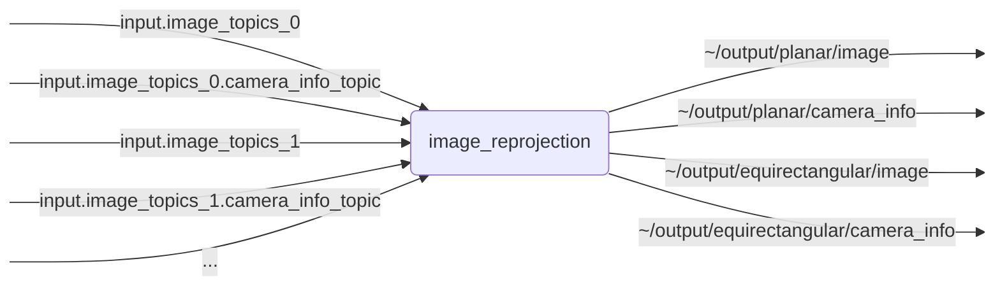

# `image_reprojection`

Reprojects multiple camera images using various projection methods

## Nodes

### `image_reprojection`

#### Subscribed Topics

| Topic | Type | Description |
| --- | --- | --- |
| `input.image_topics[:]` | `sensor_msgs/msg/Image` | input images |
| `input.<IMAGE_TOPIC>.camera_info_topic` | `sensor_msgs/msg/Image` | input camera infos |

#### Published Topics

| Topic | Type | Description |
| --- | --- | --- |
| `~/output/planar/image` | `sensor_msgs/msg/Image` | planar projection image |
| `~/output/planar/camera_info` | `sensor_msgs/msg/CameraInfo` | planar projection camera info |
| `~/output/equirectangular/image` | `sensor_msgs/msg/Image` | equirectangular projection image |
| `~/output/equirectangular/camera_info` | `sensor_msgs/msg/CameraInfo` | equirectangular projection camera info |

#### Parameters

| Parameter | Type | Default | Description |
| --- | --- | --- | --- |
| `input.image_topics` | `string[]` | `[]` | images topics to process |
| `input.<IMAGE_TOPIC>.image_transport` | `string` | `"raw"` | image transport type for subscription |
| `input.<IMAGE_TOPIC>.camera_info_topic` | `string` | `""` | corresponding camera info topic |
| `output.projection.planar.enabled` | `bool` | `true` | whether to enable planar projection |
| `output.projection.planar.image_topic` | `string` | `"~/output/planar/image"` | output image topic |
| `output.projection.planar.camera_info_topic` | `string` | `"~/output/planar/camera_info"` | output camera info topic |
| `output.projection.planar.optical_frame_id` | `string` | `""` | frame in which projection plane is defined |
| `output.projection.planar.width` | `int` | `1280` | projection width |
| `output.projection.planar.height` | `int` | `720` | projection height |
| `output.projection.planar.depth` | `float` | `1.0` | location of projection plane in specified frame |
| `output.projection.planar.fov_x` | `float` | `90.0` | horizontal field-of-view (vertical is computed via specified aspect ratio) |
| `output.projection.planar.blend_factor` | `float` | `1.0` | factor by how much to blend between overlapping partitions of the output |
| `output.projection.equirectangular.enabled` | `bool` | `false` | whether to enable equirectangular projection |
| `output.projection.equirectangular.image_topic` | `string` | `"~/output/equirectangular/image"` | output image topic |
| `output.projection.equirectangular.camera_info_topic` | `string` | `"~/output/equirectangular/camera_info"` | output camera info topic |
| `output.projection.equirectangular.optical_frame_id` | `string` | `""` | frame in which projection plane is defined |
| `output.projection.equirectangular.width` | `int` | `2048` | projection width |
| `output.projection.equirectangular.height` | `int` | `1024` | projection height |
| `output.projection.equirectangular.radius` | `float` | `1.0` | radius of spherical projection plane around specified frame |
| `output.projection.equirectangular.fov_x` | `float` | `360.0` | horizontal field-of-view (vertical is computed via specified aspect ratio) |
| `output.projection.equirectangular.blend_factor` | `float` | `1.0` | factor by how much to blend between overlapping partitions of the output |
| `output.gstreamer.config_export_path` | `string` | `""` | filepath for GStreamer config export |
| `params.recompute_every_frame` | `bool` | `false` | whether to recompute projection every frame |
| `params.transform_timeout` | `float` | `0.05` | how long to wait for transforms |
| `params.frame_timeout` | `float` | `1.0` | how long to wait for frames from all inputs |
| `params.frame_time_tolerance` | `float` | `0.005` | how much time stamp difference to accept between inputs |
| `params.sync_mode` | `string` | `"wait_all"` | `wait_all`: wait for all inputs; `lead_latest`: start publishing with leading after timeout has passed |

## Launch Files

### [`image_reprojection_launch.py`](launch/image_reprojection_launch.py)

| Argument | Default | Description |
| --- | --- | --- |
| `name` | `"image_reprojection"` | node name |
| `namespace` | `""` | node namespace |
| `params` | `os.path.join(get_package_share_directory("image_reprojection"), "config", "params.yml")` | path to parameter file |
| `log_level` | `"info"` | ROS logging level (debug, info, warn, error, fatal) |
| `use_sim_time` | `"false"` | use simulation clock |
